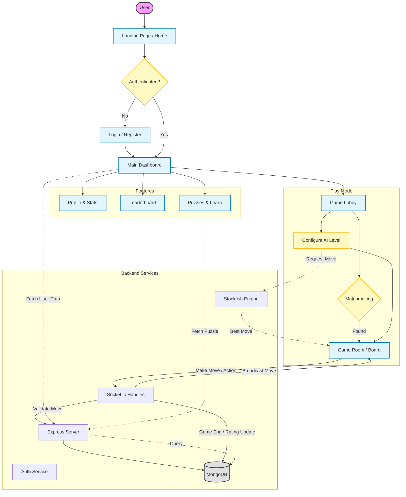

# Project Summary: Chess Learning Platform

## 1. Project Overview
The **Chess Learning Platform** is a comprehensive full-stack web application designed for playing, learning, and analyzing chess. It leverages modern web technologies to provide a real-time, interactive experience for users of all skill levels.

### Tech Stack
*   **Frontend**: Next.js 14+ (App Router), TypeScript, Tailwind CSS, Shadcn UI (Radix Primitives).
*   **Backend**: Node.js, Express.js.
*   **Database**: MongoDB (Mongoose ORM).
*   **Real-time**: Socket.io (for gameplay and matchmaking).
*   **Chess Engine**: Stockfish (for AI opponents and analysis) & chess.js (for logic).

## 2. Key Features Implemented

### ♟️ Gameplay
*   **Online Multiplayer**: Real-time PvP matches with low latency.
*   **Play vs AI**: Integration with Stockfish engine with adjustable difficulty levels.
*   **Game State Management**: Detailed move validation, legal move highlighting, checkmate/stalemate detection.
*   **Interactive UI**: Drag-and-drop piece movement, click-to-move, and move history tracking.

### 🌐 Real-Time System
*   **Matchmaking**: Automated queuing system to find opponents based on Elo rating.
*   **Live Updates**: Instant synchronization of moves, game status, and chat messages between players.
*   **Room Management**: Robust handling of game rooms, including spectators and reconnection support.

### 👤 User System
*   **Authentication**: Secure login and registration.
*   **Profiles**: Detailed user profiles exhibiting Elo ratings, match history, and performance statistics.
*   **Social**: In-game chat functionality and global leaderboards.

### 🎓 Learning & Analysis
*   **Puzzles**: Interactive chess puzzles to practice tactics.
*   **Analysis**: Post-game analysis tools to review moves and mistakes.
*   **Lessons**: Infrastructure for structured chess lessons.

---

## 3. System Architecture Flowchart

## 4. User Flow Description

1.  **Entry**: The user arrives at the landing page.
2.  **Authentication**: Accessing core features requires logging in. New users can register.
3.  **Lobby**: The central hub for starting games. Users can:
    *   Quick Match: Enter a queue to be matched with another player.
    *   Play vs AI: Select difficulty and start a local game against Stockfish.
4.  **Game Room**: The main interface where the game happens.
    *   **Moves**: Sent via Socket.io to the server.
    *   **Server**: Validates moves using `chess.js`, updates the game state in memory/database, and broadcasts the new state to both players.
    *   **Conclusion**: When checkmate/draw occurs, the server calculates new Elo ratings and saves the game record to MongoDB.
5.  **Post-Game**: Users can view the result, analyze the game, or return to the lobby.
